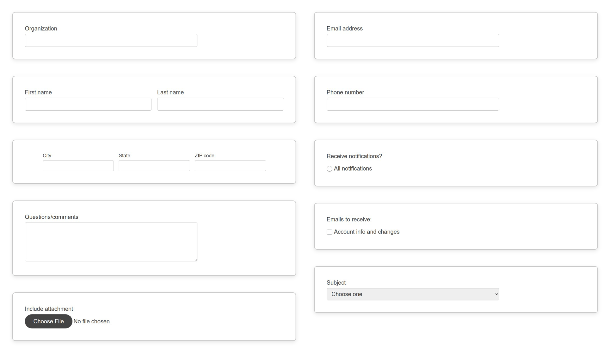

# Starter Page Components
### HTML design system of standard form components

Made for building forms. With common patterns that can be mixed and matched for any form.

### Features ###
- Responsive across screen sizes
- Dark mode compatibility
- Semantic code, optimized for accessibility
- Blocks Edit ready for drag and drop editing

## Commonly used components ##
Single text field, Two column text fields, Three column text fields, Text area field, File upload field, Email field, Phone number field, Radio buttons, Checkboxes, Select field

This theme has been put together by the Blocks Edit team. [Blocks Edit](https://blocksedit.com) makes any HTML template editable in a visual editor. So you can setup your own design for your team to build and edit email campaigns or landing pages on their own.