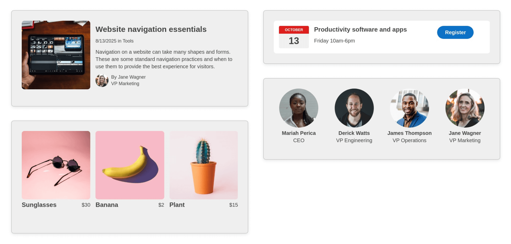

# Starter Page Components
### HTML design system of standard web content components based on hundreds of real-world websites

Made for building brochure sites, landing pages, content articles, and digital forms. With common patterns that can be mixed and matched for any type of web page.

### Features ###
- Responsive across screen sizes
- Dark mode compatibility
- Semantic code, optimized for accessibility
- Blocks Edit ready for drag and drop editing

## Commonly used components ##

### Content sections ###
Skimmable sections for a homepage and landing pages.

### Content listings ###
A series of related items like articles, products, and events.

### Article content ###
Ways to format content elements in an article.

### Form fields ###
Fields to collect information, for contact forms, surveys, etc.

This theme has been put together by the Blocks Edit team. [Blocks Edit](https://blocksedit.com) makes any HTML template editable in a visual editor. So you can setup your own design for your team to build and edit web pages on their own.