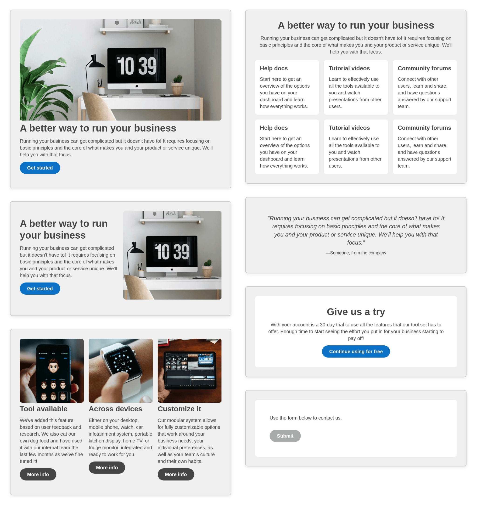
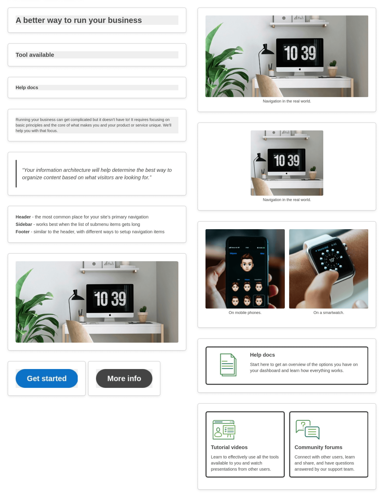

# Starter Page Components
### HTML design system of standard web content components

Made for building brochure sites, landing pages, and digital forms. With common patterns that can be mixed and matched for any type of web page.

### Features ###
- Responsive across screen sizes
- Dark mode compatibility
- Semantic code, optimized for accessibility
- Blocks Edit ready for drag and drop editing

## Commonly used components ##

### Content sections ###
Single-column, two-column, and three-column sections, features grid, testimonial, CTA, and form container

### Article content ###
Titles, body text, content image, pull quote, bullet list, buttons, image with caption, callout

### Form fields ###
Single, two-column, and three-column text fields, text area, file upload, email and phone number fields, radio buttons, checkboxes, and select dropdown

This theme has been put together by the Blocks Edit team. [Blocks Edit](https://blocksedit.com) makes any HTML template editable in a visual editor. So you can setup your own design for your team to build and edit web pages on their own.